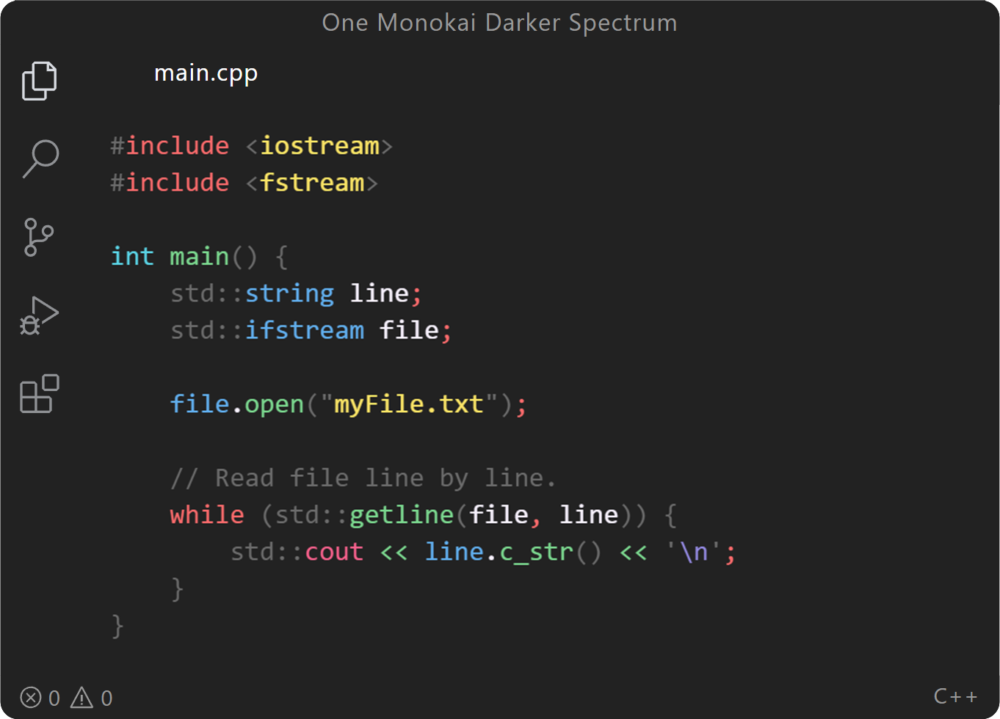
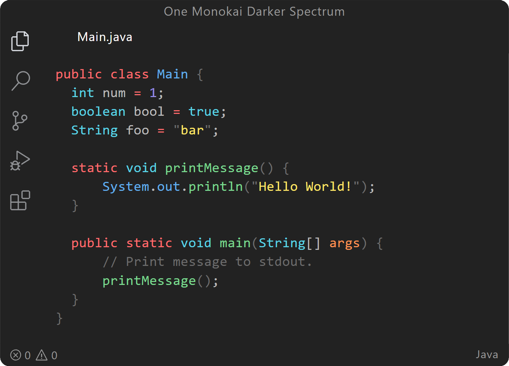
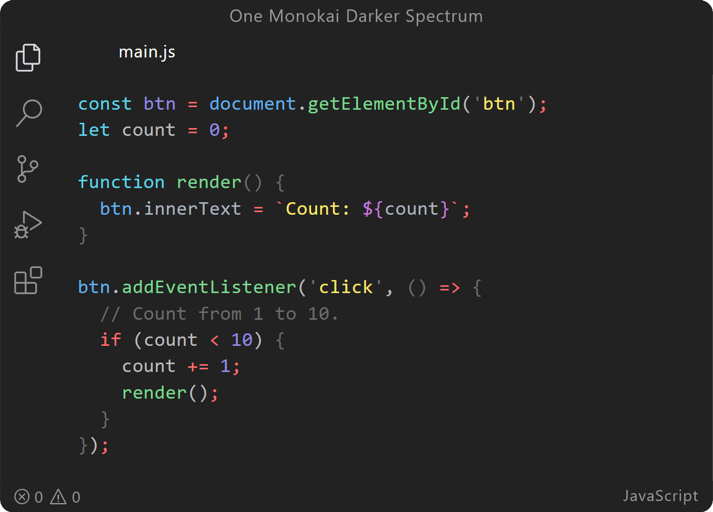

While installing dozens of themes, I realized that the only way to find the perfect theme is to make it. Or to be more precise, combine 2 other themes into new one. 

Gray background with **lots** of colors. Maybe you will like it 😇

I've only used with  **C++** and haven't tested in other languages.

## Examples

**Enjoy!**
